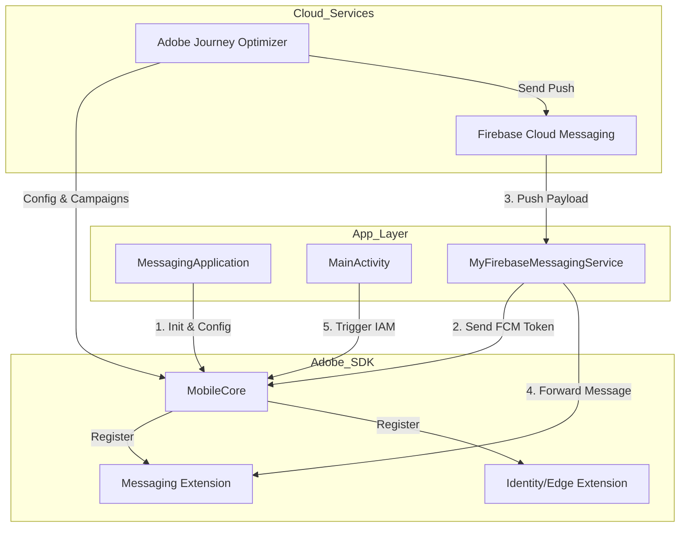

# Adobe Journey Optimizer (AJO) - Android Implementation Template

Este proyecto es una implementación de referencia para integrar el SDK de Adobe Experience Platform (AEP) con enfoque en **Adobe Journey Optimizer (AJO)**. Permite la gestión de notificaciones Push, mensajes In-App y medición de experiencias basadas en datos.

---

## 🏗️ Arquitectura y Flujo de Datos

El siguiente diagrama muestra cómo interactúan las clases principales con los servicios de Firebase y Adobe:



---

## 🐳 Docker: Ejecución y Emulación

Este proyecto incluye un entorno Dockerizado que compila el APK y levanta un emulador Android accesible vía web (noVNC).

### 1. Requisitos Previos
Normalmente, necesitarías crear un archivo `.env.local` y `app/google-services.json`, pero en este repositorio ya están incluidos por defecto para facilitar las pruebas rápidas (Asegúrate de que el repositorio sea **PRIVADO** si decides subir tus propias llaves).

Si deseas cambiarlos, el formato del `.env.local` es:
```bash
ADOBE_APP_ID="tu_id"
ADOBE_ASSURANCE_SESSION_ID="tu_id"
```
y el archivo `app/google-services.json` debe contener tu configuración de Firebase.

### 2. Opción A: Construir Localmente (Build)
Si has realizado cambios en el código y quieres generar tu propia imagen:
```bash
# Construir la imagen (esto compila el APK internamente)
docker build -t ajo-android-template .
```

### 3. Opción B: Usar Imagen de Docker Hub (Pull)
Si prefieres descargar la imagen oficial ya compilada:
```bash
docker pull alucardaywalker/ajo-android-template:latest
```

### 4. Ejecutar el Emulador (Run)
Para levantar el contenedor y ver el emulador en tu navegador:
```bash
docker run --privileged -d \
  -p 6080:6080 \
  -p 5554:5554 \
  -p 5555:5555 \
  --name ajo-emulator \
  alucardaywalker/ajo-android-template:latest
```
> **Nota:** Una vez corriendo, abre [http://localhost:6080](http://localhost:6080) en tu navegador. El APK se instalará automáticamente al iniciar.

### 5. Solución de Problemas (Windows/WSL2)
Si abres el navegador y la pantalla se queda negra (sin mostrar el teléfono), es probable que Docker no tenga acceso a la virtualización (**KVM**).

#### A. Habilitar Virtualización Anidada
1. Crea/Edita el archivo `C:\Users\[TuUsuario]\.wslconfig` con este contenido:
   ```ini
   [wsl2]
   nestedVirtualization=true
   ```
2. Reinicia WSL ejecutando en PowerShell: `wsl --shutdown`.

#### B. Extraer el APK manualmente (Plan B)
Si tu Windows es antiguo y no soporta virtualización anidada, aún puedes obtener el APK que Docker compiló:
```powershell
docker cp ajo-emulator:/opt/apps_to_install/app-debug.apk C:\Users\aluca\Desktop\OneDriveBackupFiles\Desktop\ajo-app.apk
```
*(Sustituye la ruta de destino por una carpeta válida en tu PC).*

---

## 📱 Componentes Principales

### 1. `MessagingApplication` (Punto de Entrada)
Es la clase encargada del ciclo de vida inicial.
- **`MobileCore.configureWithAppID`**: Descarga la configuración dinámica desde Adobe Launch usando el ID definido en `.env.local`.

### 2. `MyFirebaseMessagingService` (Puente Firebase)
Gestiona la comunicación con Firebase Cloud Messaging (FCM).
- **`onNewToken()`**: Envía el token de dispositivo a Adobe mediante `MobileCore.setPushIdentifier(token)`.
- **`onMessageReceived()`**: Intercepta el mensaje y lo entrega al SDK de Adobe para su visualización.

### 3. `MainActivity` (Interacción)
Controla la interfaz y los disparadores de eventos.
- **`MobileCore.trackAction()`**: Envía eventos que actúan como **triggers** para mensajes In-App configurados en AJO.

---

## 🛠️ Instalación Manual (Sin Docker)

1. **Configuración Local**:
   - El proyecto ya incluye un `.env.local` y `app/google-services.json` de ejemplo.
   - Si necesitas personalizarlos, edita directamente estos archivos antes de compilar.

2. **Compilación**:
   - Android Studio generará automáticamente `app/google-services.json` durante el proceso de Sync.

3. **Sincronizar Gradle**:
   - Haz clic en **Sync Project with Gradle Files**.

---

## 🚀 Adobe Journey Optimizer (AJO) - Requisitos
Para que el envío de mensajes funcione, verifica lo siguiente en Adobe Experience Cloud:
1. **App Surface:** Configura el Package Name `com.adobe.marketing.mobile.messagingsample` y sube tu Server Key de Firebase.
2. **Datastream:** Debe tener activo el servicio de Adobe Journey Optimizer apuntando a la App Surface.
3. **Campaña:** El nombre del evento en `trackAction("evento")` debe coincidir con el trigger de tu campaña In-App en AJO.

---

## 🔍 Análisis del Intercambio de Datos (JSON)

Basado en la documentación oficial de Adobe, el intercambio de información se divide en dos flujos principales:

### 1. Flujo de Notificaciones Push (AJO Push)
El flujo de datos sigue estos pasos:
1. **Registro:** La App recibe el token de Firebase (FCM Token).
2. **Sincronización:** El código ejecuta `MobileCore.setPushIdentifier(token)`, enviando un evento XDM a Adobe con el token.
3. **Envío:** AJO dispara un push enviando un JSON a Firebase.
4. **Recepción:** Firebase entrega el mensaje a la App.
5. **Procesamiento:** `MessagingService.handleRemoteMessage(this, message)` es el método que "abre" el JSON y extrae el payload.

**Estructura del JSON Push:**
Adobe envía campos específicos para personalización y tracking:
- `adb_title`: Título de la notificación.
- `adb_body`: Cuerpo del mensaje.
- `adb_m_id`: ID del mensaje en Adobe (vital para métricas de tracking).
- `adb_uri`: Deep Link opcional si fue configurado.

### 2. Flujo de Mensajes In-App (AJO In-App)
A diferencia del Push, estos mensajes **no pasan por Firebase**:
1. **Descarga:** Al iniciar la App, el SDK descarga un JSON con todas las "Reglas de Consecuencia" activas.
2. **Trigger:** Al ejecutar `MobileCore.trackAction("evento")`, el SDK busca coincidencias en el JSON descargado localmente.
3. **Renderizado:** Si hay coincidencia, el SDK extrae el HTML/CSS/JSON del mensaje y lo muestra en un WebView.

**Estructura del JSON In-App (simplificado):**
```json
{
  "rules": [{
    "condition": { "type": "matcher", "key": "action", "value": "mi_evento" },
    "consequences": [{
      "type": "cjmiam",
      "detail": {
        "html": "<html>...</html>",
        "mobileParameters": { "uiTakeover": true }
      }
    }]
  }]
}
```

---

## 💡 Notas de Implementación
- **Simulación Local:** La función `showCustomAjoDemoMessage()` en `MainActivity.kt` simula este comportamiento construyendo el JSON manualmente para pruebas de diseño sin depender de una campaña activa.
- **Producción:** En un entorno real, Adobe gestiona estos JSONs automáticamente desde su consola; la app solo debe estar suscrita a los eventos correctos.
- **Tracking:** Se ha optimizado el manejo del Intent en `MainActivity` para asegurar que las métricas de apertura de notificaciones se registren correctamente en Adobe Journey Optimizer.


docker cp ajo-emulator:/opt/apps_to_install/app-debug.apk C:\Users\aluca\Desktop\OneDriveBackupFiles\Desktop\ajo-app.apk
Successfully copied 13.4MB to C:\Users\aluca\Desktop\OneDriveBackupFiles\Desktop\ajo-app.apk
PS C:\Users\aluca\OneDrive\Desktop\ia\android\adobe\ajo\adobe-sdk-android> 
