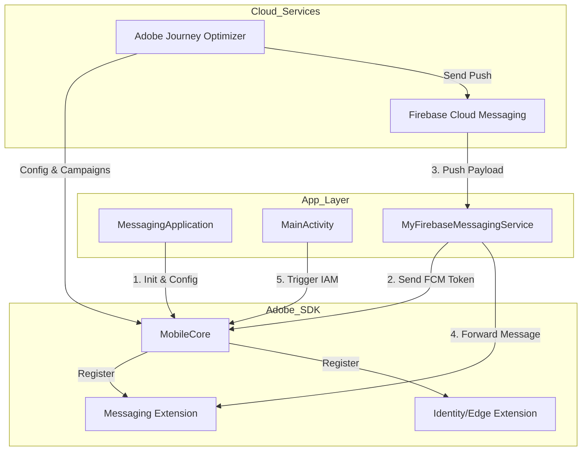

# Adobe Journey Optimizer (AJO) - Android Implementation Template

Este proyecto es una implementación de referencia para integrar el SDK de Adobe Experience Platform (AEP) con enfoque en **Adobe Journey Optimizer (AJO)**. Permite la gestión de notificaciones Push, mensajes In-App y medición de experiencias basadas en datos.

---

## 🏗️ Arquitectura y Flujo de Datos

El siguiente diagrama muestra cómo interactúan las clases principales con los servicios de Firebase y Adobe:



---

## 📱 Componentes Principales

### 1. `MessagingApplication` (Punto de Entrada)
Es la clase encargada del ciclo de vida inicial.
- **`onCreate()`**: Inicializa el SDK.
- **`MobileCore.registerExtensions`**: Activa las extensiones necesarias (`Messaging`, `Identity`, `Edge`, `Assurance`).
- **`MobileCore.configureWithAppID`**: Descarga la configuración dinámica desde Adobe Launch usando el ID definido en `.env.local`.

### 2. `MyFirebaseMessagingService` (Puente Firebase)
Gestiona la comunicación con Firebase Cloud Messaging (FCM).
- **`onNewToken()`**: Envía el token de dispositivo a Adobe mediante `MobileCore.setPushIdentifier(token)`. Este paso es vital para que AJO sepa a quién enviar el Push.
- **`onMessageReceived()`**: Intercepta el mensaje. Si el payload pertenece a Adobe, `MessagingService.handleRemoteMessage` lo procesa automáticamente para mostrar la notificación.

### 3. `MainActivity` (Interacción)
Controla la interfaz y los disparadores de eventos.
- **`MobileCore.trackAction()`**: Envía eventos de "clic" o "vistas" que actúan como **triggers** para mensajes In-App configurados en AJO.
- **`Messaging.handleNotificationResponse()`**: Rastrea si el usuario abrió la app desde una notificación push para métricas de conversión.

---

## 📊 Estructuras de Datos (JSON)

### Configuración del Proyecto (`.env.local`)
Este archivo (protegido por `.gitignore`) centraliza los secretos:
```json
{
  "ADOBE_APP_ID": "tu_id_de_adobe_launch",
  "GOOGLE_SERVICES_JSON_CONTENT": {
    "project_info": { "project_id": "ajoapp-test" },
    "client": [ { "client_info": { "mobilesdk_app_id": "..." } } ]
  }
}
```

### Payload de Notificación Push (AJO -> App)
Cuando AJO envía un push, el JSON que recibe `MyFirebaseMessagingService` tiene esta estructura:
```json
{
  "message": {
    "data": {
      "adb_title": "Título del mensaje",
      "adb_body": "Contenido del mensaje",
      "adb_m_id": "id_de_campaña_ajo",
      "adb_uri": "deeplink_opcional"
    }
  }
}
```

### Payload de Mensaje In-App
Los mensajes In-App se descargan como reglas de consecuencia:
```json
{
  "consequences": [{
    "id": "id_del_mensaje",
    "type": "cjmiam",
    "detail": {
      "html": "<html>...</html>",
      "mobileParameters": {
        "verticalAlign": "center",
        "uiTakeover": true
      }
    }
  }]
}
```

---

## 🛠️ Instalación y Configuración

1. **Requisitos de Firebase**:
   - Crea un proyecto en [Firebase Console](https://console.firebase.google.com/).
   - Obtén el archivo `google-services.json` o copia su contenido.

2. **Configuración Local**:
   - Copia el archivo `.env.example` (si existe) a `.env.local`.
   - Pega tu `ADOBE_APP_ID` y el contenido de tu JSON de Firebase en `GOOGLE_SERVICES_JSON_CONTENT`.

3. **Compilación**:
   - El archivo `app/build.gradle.kts` generará automáticamente el archivo `app/google-services.json` real durante el proceso de Sync o Build.

4. **Sincronizar Gradle**:
   - Haz clic en **Sync Project with Gradle Files** en Android Studio.

---

## 🚀 Ejecución
- Selecciona el módulo `app`.
- Ejecuta en un emulador o dispositivo real con Google Play Services.
- Revisa el **Logcat** filtrando por "Adobe" para verificar que las extensiones se registraron con éxito.


1. Explicación del Código y Métodos
   A. Inicialización (MessagingApplication.kt)
   Es el corazón de la conexión.
   •
   MobileCore.registerExtensions: Registra las "piezas" del SDK. Para AJO son vitales:
   ◦
   Messaging: Maneja la lógica de visualización de Push e In-App.
   ◦
   Edge & Identity: Permiten que la app hable con los servidores de Adobe y que Adobe sepa quién es el usuario (generando un ECID único).
   •
   MobileCore.configureWithAppID: Usa el ID de tu .env.local para descargar toda la configuración que hiciste en la consola de Adobe (Launch/Data Collection).
   B. Notificaciones Push (MyFirebaseMessagingService.kt)
   •
   onNewToken: Cuando Firebase genera un token para el dispositivo, ejecutamos MobileCore.setPushIdentifier(token).
   ◦
   ¿Por qué es crítico? Esto le "dice" a Adobe: "Este usuario tiene este token de Firebase". Sin esto, AJO no sabe a dónde enviar el mensaje.
   •
   MessagingService.handleRemoteMessage: Cuando llega un mensaje, el SDK de Adobe lo intercepta. Si el mensaje viene de AJO, Adobe se encarga de mostrar la notificación y medir si el usuario hizo clic.
   C. Mensajes In-App (MainActivity.kt)
   •
   MobileCore.trackAction("nombre_evento", ...): Los mensajes In-App en AJO no se "envían" como los push, sino que "viven" en el SDK esperando un disparador (trigger). Cuando llamas a este método, el SDK revisa si hay algún mensaje configurado para mostrarse con ese nombre de evento.
2. Requisitos en la Consola de Adobe (AJO)
   Para que el código que ya configuramos funcione, debes verificar estos 4 puntos en Adobe Experience Cloud:
   Requisito 1: Configuración de la Superficie de la App (App Surface)
   En AJO, debes crear una "Surface" (Superficie) donde:
1.
Subas la API Key de Firebase (la que está en tu .env.local).
2.
Configures el Package Name: com.adobe.marketing.mobile.messagingsample.
3.
Esto genera un App Surface ID que debe estar vinculado a tu configuración de Datastream.
Requisito 2: El Datastream (Capa de Datos)
En la sección de Data Collection:
•
Tu Datastream debe tener activado el servicio Adobe Experience Platform.
•
Dentro de ese servicio, debe estar marcada la casilla de Adobe Journey Optimizer.
•
Debes seleccionar el App Surface creado en el requisito 1.
Requisito 3: Esquema de Datos (XDM)
El esquema que utilices para enviar datos a Adobe debe tener activados los "Field Groups" de mensajería:
•
Adobe Journey Optimizer ExperienceEvent ExperienceListing
•
Application Details (para saber versión de app, OS, etc.)
Requisito 4: Creación de la Campaña en AJO
•
Para Push: Al crear la campaña, selecciona tu "Surface" configurada. AJO usará el token que enviamos con setPushIdentifier para disparar el mensaje vía Firebase.
•
Para In-App: El "Trigger" de la campaña debe coincidir exactamente con el nombre que pongas en MobileCore.trackAction("nombre_del_evento").
Resumen de Conexión
Canal
Disparador en Código
Requisito en Adobe
Push
setPushIdentifier(token)
Credenciales de Firebase (Server Key) en la consola de Adobe.
In-App
trackAction("evento")
Campaña activa en AJO con el trigger "evento".
Ambos
configureWithAppID
El App ID debe estar vinculado a un Datastream con AJO activo.